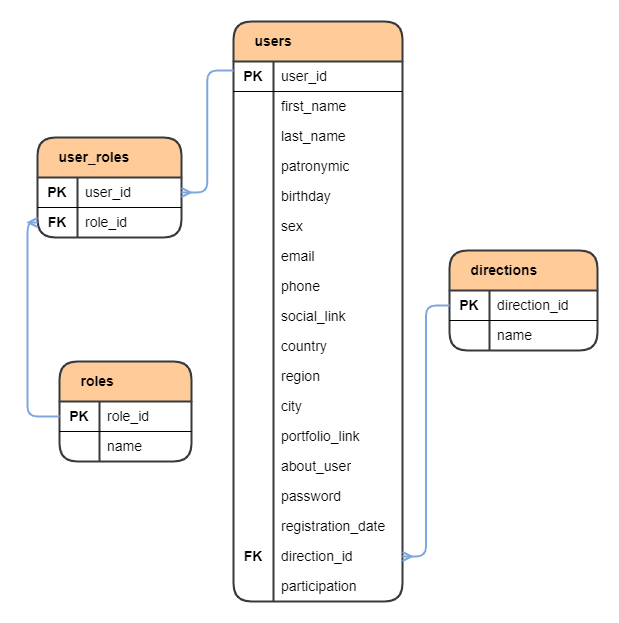

# Kardo

### Технологический стек:

1. Java 17;
2. Spring Boot 3;
3. Spring Security;
4. Apache Maven;
5. PostgreSQL;
6. Docker;
7. Hibernate;
8. Swagger;
9. Lombok.

### _Команда проекта_

* _**Надежда Денисова**_ - `Project Manager`
* _**Вероника Кусакина**_ - `Product Manager`
* _**Анастасия Алексеева**_ - `Designer`
* _**Виктория Аскинази**_ - `Designer`
* _**Ирина Белокрылова**_ - `Designer`
* _**Иван Чернышев**_ - `Frontend Developer`
* _**Кирилл Бегей**_ - `Frontend Developer`
* _**Александр Литвинов**_ - `Backend Developer`
* _**Елена Смирнова**_ - `QA`
* _**Роман Неклюдов**_ - `QA`

## _Как запустить?_

1. Требуется ПК с Unix подобной ОС: Mac OS, Linux (например Ubuntu). Для остальных ОС требуется поднять виртуальную
   машину (например с помощью VirtualBox, WSL) с одной из Unix подобных ОС.
2. Установить Docker;
3. Клонировать репозиторий;
4. Создать jar файлы из модулей проекта, например через Intellij IDEA с помощью команды mvn package (при повторной
   пересборке рекомендуется использовать чистую сборку: mvn clean package);
5. Запустить приложение через терминал, из папки проекта, командой docker-compose up.

Локально, без Docker'a можно запустить проект на БД H2. Предварительно нужно сменить профиль 
Спринга в модуле: kardo-service-server/src/main/resources/, файл: application.property, опция: 
spring.profiles.active=test-db. После этого запускаем два микросервиса: KardoGateway и KardoServiceServer, 
в одноимённых модулях.

## _API спецификация_

При написании проекта применялась библиотека Swagger, для автоматического написания API документации.

### Ссылки на Swagger-ui

1. Проект запущен на удалённом сервере, ссылки:

http://51.250.40.10:8080/swagger-ui/index.html

http://51.250.40.10:8080/v3/api-docs

2. Ссылки при запуске на локальном устройстве:

http://localhost:8080/swagger-ui/index.html

http://localhost:8080/v3/api-docs

3. Также в папке проекта, в корневом каталоге есть финальная версия спецификации в json формате. 
Путь к файлу: 

kardo/kardo-spec.json

Её можно открыть через браузерную версию SwaggerEditor просто скопировав данные с json файла целиком, и
вставив их в окно, предназначенное под спецификацию в формате json и yaml. Ссылка на SwagerEditor:

https://editor-next.swagger.io/

## _База данных проекта_

### _Схема базы данных_

### _Описание базы данных_
1. Таблица `users`. Содержит данные о пользователях приложения.
   * _**user_id**_ (первичный ключ) - уникальный идентификатор пользователя;
   * _**first_name**_ - имя;
   * _**last_name**_ - фамилия;
   * _**patronymic**_ - отчество;
   * _**birthday**_ - дата рождения;
   * _**sex**_ - пол (мужской/женский);
   * _**email**_ - электронная почта;
   * _**phone**_ - номер телефона;
   * _**social_link**_ - ссылка на социальную сеть пользователя;
   * _**country**_ - страна проживания;
   * _**region**_ - регион проживания;
   * _**city**_ - город проживания;
   * _**portfolio_link**_ - ссылка на портфолио пользователя;
   * _**about_user**_ - информация о пользователе / о себе / опыт и достижения; 
   * _**password**_ - пароль от аккаунта;
   * _**registration_date**_ - дата и время регистрации в приложении;
   * _**direction_id**_ (внешний ключ) - идентификатор направления выбранного пользователем;
   * _**participation**_ - является ли пользователь участником.
2. Таблица `directions`. Содержит информацию о направлениях конкурсов.
   * _**direction_id**_ (первичный ключ) - идентификатор направления;
   * _**name**_ - название направления.
3. Таблица `roles`. Содержит информацию о ролях пользователей. Сущность реализует уровень 
доступа пользователей к различным частям приложения.
   * _**role_id**_ (первичный ключ) - идентификатор роли;
   * _**name**_ - название роли.
4. Таблица `user_roles`. Обеспечивает связь многие ко многим между пользователями и их ролями.
   * _**user_id**_ (внешний ключ) - идентификатор пользователя;
   * _**role_id**_ (внешний ключ) - идентификатор роли.